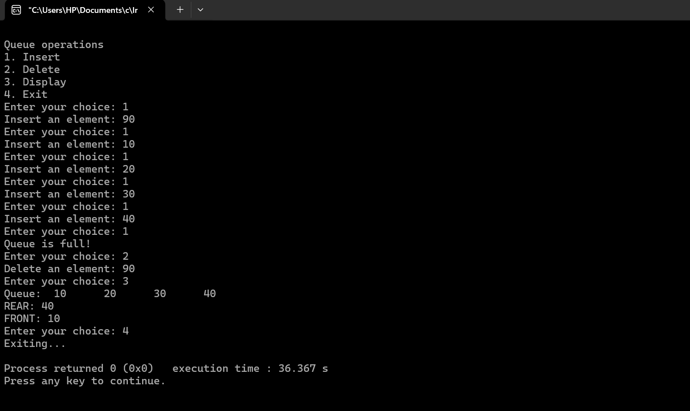

# Queue Operations 
The queue is implemented using an array with operations like Insertion (Enqueue), Deletion (Dequeue), and Display.

## Features
- **Insert (Enqueue):** Add elements to the queue.
- **Delete (Dequeue):** Remove elements from the queue.
- **Display:** Show current elements in the queue also show front and rear pointers.

## Queue Insertion[Pseudocode].

---

### **QINSERT(QUEUE, FRONT, REAR, ITEM)**  
This procedure inserts an element **ITEM** into a queue.  

#### **Steps:**
1. **Check if the queue is full:**  
   - **If** `FRONT = 1` and `REAR = N`, or  
   - **If** `FRONT = REAR + 1`,  
     - **Then:** Print `"Overflow"` and **Return**.  

2. **Find the new value of REAR:**  
   - **If** `FRONT = NULL` (Queue is initially empty),  
     - Set `FRONT = 1` and `REAR = 1`.  
   - **Else If** `REAR = N`,  
     - Set `REAR = 1`.  
   - **Else**,  
     - Set `REAR = REAR + 1`.  

3. **Insert the new element:**  
   - Set `QUEUE[REAR] = ITEM`.(This insert new element)  

4. **Return.**  

---

## Queue Deletion[Pseudocode].

---
### **QDELETE(QUEUE, FRONT, REAR,N, ITEM)**  
This procedure delets an element from queue and assigns it to the variable **ITEM**.  
#### **Steps:**
1. **Check if the queue is already empty:**  
   - **If** `FRONT = Null`     
     - **Then:** Print `"Underflow"` and **Return**.
2. **Set, `ITEM= QUEUE[FRONT]`**
3. **Find the new value of FRONT:**
   - **If** `FRONT = REAR` (Queue has only one element to start).  
     - Set `FRONT = Null` and `REAR = Null`.  
   - **Else If** `FRONT = N`,  
     - Set `FRONT=1`.  
   - **Else**,  
     - Set `FRONT = FRONT + 1`.(End of if structure).
4. **Return.**  

--- 
# Queue Visualization

   

